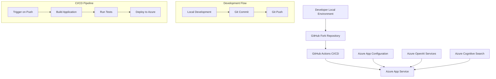

# Design Document

## Overview

This design outlines the migration from a manual local development workflow to a GitHub-based CI/CD pipeline for the NGO AI Assistant project. The solution leverages GitHub Actions for automated deployment to Azure App Service, ensuring consistent, traceable, and reliable deployments.

## Architecture

### High-Level Architecture



### Repository Structure

```
sample-app-aoai-chatGPT/
├── .github/
│   └── workflows/
│       └── azure-deploy.yml
├── src/
│   ├── components/
│   ├── pages/
│   └── api/
├── public/
├── package.json
├── next.config.js
├── .env.local (local only)
├── .gitignore
└── README.md
```

## Components and Interfaces

### 1. Source Code Management

**GitHub Fork Repository**
- **Purpose**: Central source of truth for the codebase
- **Location**: `https://github.com/[username]/sample-app-aoai-chatGPT`
- **Branch Strategy**: 
  - `main`: Production-ready code
  - `develop`: Integration branch for features
  - Feature branches: `feature/[feature-name]`

**Local Development Environment**
- **Setup**: Clone of GitHub fork
- **Configuration**: `.env.local` file with Azure service credentials
- **Workflow**: Standard Git workflow (add, commit, push)

### 2. CI/CD Pipeline

**GitHub Actions Workflow**
- **Trigger**: Push to `main` branch
- **File**: `.github/workflows/azure-deploy.yml`
- **Steps**:
  1. Checkout code
  2. Setup Node.js environment
  3. Install dependencies
  4. Build application
  5. Deploy to Azure App Service

**Azure App Service Deployment**
- **Method**: GitHub Actions deployment
- **Configuration**: Environment variables stored in Azure App Service settings
- **Deployment Slots**: Production slot with option for staging

### 3. Environment Configuration

**Local Environment Variables (.env.local)**
```
AZURE_OPENAI_ENDPOINT=https://[resource-name].openai.azure.com/
AZURE_OPENAI_KEY=[key]
AZURE_OPENAI_DEPLOYMENT=[deployment-name]
AZURE_OPENAI_MODEL=gpt-4
AZURE_SEARCH_SERVICE=https://[search-service].search.windows.net
AZURE_SEARCH_INDEX=[index-name]
AZURE_SEARCH_KEY=[search-key]
AZURE_SEARCH_CONTENT_COLUMNS=content
AZURE_SEARCH_IS_PRECHUNKED=false
```

**Azure App Service Configuration**
- Same environment variables configured in Azure portal
- Secure storage of sensitive values
- No secrets committed to repository

## Data Models

### Configuration Model
```typescript
interface AzureConfig {
  openai: {
    endpoint: string;
    key: string;
    deployment: string;
    model: string;
  };
  search: {
    service: string;
    index: string;
    key: string;
    contentColumns: string;
    isPrechunked: boolean;
  };
}
```

### Deployment Model
```typescript
interface DeploymentInfo {
  commitHash: string;
  timestamp: Date;
  branch: string;
  status: 'pending' | 'success' | 'failed';
  logs: string[];
}
```

## Error Handling

### Build Failures
- **Detection**: GitHub Actions build step failure
- **Response**: 
  - Stop deployment process
  - Send notification to developer
  - Preserve previous working deployment
- **Recovery**: Fix code issues and push new commit

### Deployment Failures
- **Detection**: Azure deployment step failure
- **Response**:
  - Rollback to previous successful deployment
  - Log detailed error information
  - Alert developer via GitHub notifications
- **Recovery**: Investigate logs, fix issues, redeploy

### Environment Variable Mismatches
- **Detection**: Application runtime errors
- **Response**:
  - Log configuration errors
  - Provide clear error messages
  - Prevent application startup if critical variables missing
- **Recovery**: Update Azure App Service configuration

### Network and Service Failures
- **Detection**: Azure service connectivity issues
- **Response**:
  - Implement retry logic for transient failures
  - Graceful degradation where possible
  - Clear error messages to users
- **Recovery**: Monitor Azure service status, implement circuit breaker pattern

## Testing Strategy

### Local Testing
- **Unit Tests**: Component and function-level tests
- **Integration Tests**: API endpoint testing
- **Environment Validation**: Verify all required environment variables
- **Build Verification**: Ensure application builds successfully

### CI/CD Testing
- **Automated Build Tests**: Run during GitHub Actions workflow
- **Deployment Verification**: Post-deployment health checks
- **Smoke Tests**: Basic functionality verification after deployment
- **Environment Consistency**: Validate production environment matches expectations

### Manual Testing
- **Pre-deployment**: Local testing of new features
- **Post-deployment**: Verification of live application functionality
- **User Acceptance**: Validate user-facing features work correctly

## Migration Strategy

### Phase 1: Repository Setup
1. Fork Microsoft template repository
2. Clone fork locally
3. Configure local environment variables
4. Verify local development environment

### Phase 2: CI/CD Configuration
1. Create GitHub Actions workflow file
2. Configure Azure App Service for GitHub deployment
3. Set up environment variables in Azure
4. Test deployment pipeline with simple change

### Phase 3: Code Migration
1. Identify custom code from existing project
2. Integrate custom features into forked template
3. Resolve any conflicts or compatibility issues
4. Test migrated functionality locally

### Phase 4: Validation and Cutover
1. Deploy migrated application via CI/CD
2. Validate all functionality works correctly
3. Update DNS/routing if necessary
4. Decommission old deployment method

## Security Considerations

- Environment variables stored securely in Azure App Service
- No secrets committed to GitHub repository
- GitHub repository access controls properly configured
- Azure App Service authentication and authorization configured
- Regular security updates for dependencies