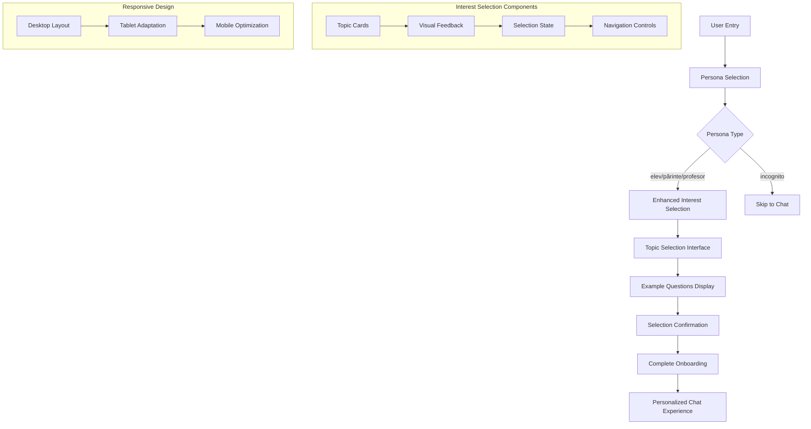

# Design Document

## Overview

This design outlines the enhancement of the existing onboarding flow for the NGO AI Assistant application, specifically focusing on improving the interest selection step. The solution will create a more intuitive, visually appealing, and accessible interface that better guides users through choosing their areas of interest while maintaining consistency with the existing persona-based theming system.

## Architecture

### High-Level Architecture



### Component Structure

```
OnboardingFlow/
├── PersonaSelection.tsx (existing)
├── InterestSelection.tsx (enhanced)
├── components/
│   ├── TopicCard.tsx (new)
│   ├── ExampleQuestions.tsx (new)
│   ├── NavigationControls.tsx (new)
│   └── SkipOption.tsx (new)
├── hooks/
│   ├── useOnboardingState.ts (new)
│   └── usePersonaTheme.ts (existing)
└── styles/
    ├── InterestSelection.module.css (new)
    └── TopicCard.module.css (new)
```

## Components and Interfaces

### 1. Enhanced Interest Selection Component

**Purpose**: Clean, focused topic selection interface that prepares context for AI conversation
**Key Features**:
- Persona-aware theming and background
- Modal-style centered container
- Simple topic selection cards
- Context generation for OpenAI warm-up prompt
- Quick questions preparation for chat interface

**Interface**:
```typescript
interface EnhancedInterestSelectionProps {
  persona: Persona
  onSelect: (topic: TopicSelectionData) => void
  onBack: () => void
  onStartChat: (context: OnboardingContext) => void
}
```

### 2. Topic Card Component

**Purpose**: Clean, minimal card for each interest topic
**Key Features**:
- Simple hover and selection states
- Clean typography
- Minimal visual design
- Persona-themed selection indicators

**Interface**:
```typescript
interface TopicCardProps {
  topic: QuickQuestionTopic
  persona: Persona
  isSelected: boolean
  onSelect: (topicLabel: string) => void
  className?: string
}
```

### 3. Modal-Style Container

**Purpose**: Centered white container on persona-themed background
**Key Features**:
- Centered layout with max-width
- White background with subtle shadow
- Persona-themed background gradient
- Responsive padding and spacing

**Interface**:
```typescript
interface OnboardingContainerProps {
  persona: Persona
  children: React.ReactNode
  className?: string
}
```

### 4. Navigation Controls Component

**Purpose**: Consistent navigation between onboarding steps
**Key Features**:
- Back button with persona theming
- Progress indication
- Keyboard navigation support

**Interface**:
```typescript
interface NavigationControlsProps {
  onBack: () => void
  currentStep: number
  totalSteps: number
  persona: Persona
}
```

## Data Models

### Topic Configuration Based on Existing Data Structure
```typescript
// Matches the existing onboardingQuickQuestions.json structure
interface QuickQuestionTopic {
  label: string
  questions: string[] // Exactly 3 questions per topic
}

interface PersonaQuickQuestions {
  topics: QuickQuestionTopic[] // Exactly 4 topics per persona
}

interface OnboardingQuickQuestionsData {
  elev: PersonaQuickQuestions
  parinte: PersonaQuickQuestions // Note: "parinte" without diacritic in JSON
  profesor: PersonaQuickQuestions
}

interface OnboardingContext {
  persona: Persona
  selectedTopic: QuickQuestionTopic
  warmUpPrompt: string // Generated prompt for OpenAI service
  quickQuestions: string[] // The 3 questions from selected topic
}

// Example warm-up prompt generation
const generateWarmUpPrompt = (persona: Persona, topic: QuickQuestionTopic): string => {
  const personaMap = {
    'elev': 'student',
    'părinte': 'parent', 
    'profesor': 'teacher',
    'incognito': 'user'
  }
  
  return `You are about to engage in a conversation with a ${personaMap[persona]} who is interested in: "${topic.label}". 
  Please provide helpful, age-appropriate responses tailored to this persona and topic area.`
}
```

### Onboarding State Management
```typescript
interface OnboardingState {
  currentStep: 'persona' | 'interest' | 'complete'
  selectedPersona: Persona | null
  selectedTopic: TopicSelectionData | null
  generatedContext: OnboardingContext | null
  isLoading: boolean
  error: string | null
}

interface OnboardingActions {
  setPersona: (persona: Persona) => void
  setTopic: (topic: TopicSelectionData) => void
  generateContext: () => OnboardingContext
  goBack: () => void
  complete: () => void
  reset: () => void
}
```

## Visual Design System

### Layout Structure - Matching Persona Selection Design

**Exact Same Modal Container as Persona Selection**:
- Centered white container: max-width 480px, same as persona step
- Same persona-themed gradient background (full viewport)
- Same container padding: 40px
- Same border radius: 16px
- Same subtle shadow and styling

**Topic Cards Layout (Similar to Persona Cards)**:
- 2x2 grid layout for the 4 topics (matching persona card grid)
- Same card dimensions and spacing as persona cards
- Same hover states and selection indicators
- Same radio button style selection (top-right corner)
- Clean typography matching persona cards

**Header Structure**:
- Same "narada" logo at top
- Same heading style: "Perfect! Ești [persona]" (matching "Bună, eu sunt asistentul tău!")
- Same subtitle explaining topic selection
- Same question format: "Ce te interesează cel mai mult?"

**Button Layout**:
- Same footer button layout as persona selection
- "Înapoi" button (left) - same gray styling as persona step
- "Începe Chat-ul" button (right) - persona-themed, enabled when topic selected
- Same button dimensions and styling

### Typography Hierarchy

```css
/* Main heading */
.heading-primary {
  font-size: 2rem;
  font-weight: 700;
  line-height: 1.2;
  margin-bottom: 1rem;
}

/* Topic labels */
.heading-secondary {
  font-size: 1.125rem;
  font-weight: 600;
  line-height: 1.4;
  margin-bottom: 0.75rem;
}

/* Example questions */
.text-body {
  font-size: 0.875rem;
  font-weight: 400;
  line-height: 1.5;
  color: #6b7280;
}

/* Buttons */
.button-text {
  font-size: 1rem;
  font-weight: 500;
  line-height: 1.25;
}
```

### Color System Integration

The design leverages the existing persona-based color system:

```typescript
// Persona-specific color mappings
const personaColors = {
  elev: {
    primary: '#D0337D',
    secondary: '#F8D7E7',
    background: '#FEEFF7',
    accent: '#B02A6B'
  },
  părinte: {
    primary: '#ff4773',
    secondary: '#FFD6E1', 
    background: '#FFF0F3',
    accent: '#E63E66'
  },
  profesor: {
    primary: '#9a6ae1',
    secondary: '#E6D9FF',
    background: '#F5F0FF',
    accent: '#8A5DD1'
  }
}
```

### Animation and Transitions

**Card Interactions**:
- Hover: Scale(1.02) + Shadow elevation
- Focus: Border highlight + Scale(1.01)
- Selection: Background color change + Check icon
- Duration: 200ms ease-out

**Page Transitions**:
- Slide in/out: 300ms ease-in-out
- Fade effects: 150ms ease-out
- Loading states: Skeleton animations

## Accessibility Features

### Keyboard Navigation
- Tab order: Header → Back button → Topic cards → Skip button
- Enter/Space: Activate selected card
- Arrow keys: Navigate between cards
- Escape: Return to previous step

### Screen Reader Support
```html
<!-- Topic card structure -->
<div role="button" 
     tabindex="0"
     aria-label="Select topic: [topic label]"
     aria-describedby="topic-description-[id]"
     aria-pressed="false">
  
  <h3 id="topic-title-[id]">[Topic Label]</h3>
  <div id="topic-description-[id]">
    Example questions: [questions preview]
  </div>
</div>
```

### Visual Accessibility
- Color contrast ratio: Minimum 4.5:1 for normal text
- Focus indicators: 2px solid outline with persona color
- Text scaling: Support up to 200% zoom
- Motion preferences: Respect `prefers-reduced-motion`

## Error Handling

### Loading States
- **Initial Load**: Skeleton cards with shimmer effect
- **Topic Selection**: Disabled state with loading spinner
- **Navigation**: Prevent double-clicks during transitions

### Error Scenarios
- **Missing Topic Data**: Show fallback message with retry option
- **Network Issues**: Offline-friendly with cached data
- **Invalid Selections**: Clear error messages with correction guidance

### Recovery Mechanisms
```typescript
const errorHandling = {
  missingTopics: {
    fallback: 'Skip to general chat',
    retry: 'Reload topic data',
    message: 'Unable to load topics. You can skip this step or try again.'
  },
  selectionError: {
    reset: 'Clear selection',
    message: 'Something went wrong. Please try selecting again.'
  }
}
```

## Testing Strategy

### Unit Testing
- Component rendering with different personas
- Topic selection logic
- Navigation state management
- Accessibility attributes

### Integration Testing
- Complete onboarding flow
- Persona theme application
- Data persistence across steps
- Error boundary behavior

### Visual Testing
- Cross-browser compatibility
- Responsive design breakpoints
- Persona theme consistency
- Animation performance

### Accessibility Testing
- Screen reader compatibility
- Keyboard navigation flow
- Color contrast validation
- Focus management

## Performance Considerations

### Optimization Strategies
- **Lazy Loading**: Load topic data on demand
- **Image Optimization**: Compress and serve appropriate sizes
- **Code Splitting**: Separate onboarding bundle
- **Caching**: Store persona configurations locally

### Bundle Size Management
```typescript
// Dynamic imports for topic configurations
const loadTopicConfig = async (persona: Persona) => {
  const config = await import(`../config/topics/${persona}.ts`)
  return config.default
}
```

### Animation Performance
- Use `transform` and `opacity` for animations
- Implement `will-change` for animated elements
- Debounce rapid interactions
- Provide reduced motion alternatives

## Implementation Phases

### Phase 1: Core Enhancement
1. Redesign InterestSelection component layout
2. Implement TopicCard component with basic interactions
3. Add persona-themed styling
4. Ensure responsive design

### Phase 2: Advanced Features
1. Add smooth animations and transitions
2. Implement ExampleQuestions component
3. Add skip functionality
4. Enhance navigation controls

### Phase 3: Accessibility & Polish
1. Complete accessibility implementation
2. Add comprehensive error handling
3. Optimize performance
4. Conduct thorough testing

### Phase 4: Integration & Validation
1. Integrate with existing onboarding flow
2. Test persona theme consistency
3. Validate user experience
4. Deploy and monitor

## Chat Interface Integration

### Quick Questions Display
After onboarding completion, the chat interface will receive the selected topic's 3 questions and display them as ready-made conversation starters:

```typescript
interface ChatQuickQuestionsProps {
  questions: string[] // Always exactly 3 questions
  persona: Persona
  onQuestionSelect: (question: string) => void
}

// Example: Questions for elev -> "să învăț mai bine și să primesc sfaturi pentru teme și școală"
const exampleQuestions = [
  "Am o temă grea. Cum pot să-mi ușurez munca?",
  "Cum învăț mai eficient pentru un test important?", 
  "Ce pot face când mă plictisesc la ore?"
]

// Example: Questions for parinte -> "să îmi ajut copilul la școală cu sfaturi pentru teme și obiceiuri bune acasă"
const parentExampleQuestions = [
  "Cum pot face temele mai ușor de suportat pentru copilul meu?",
  "Ce rutine zilnice pot ajuta la învățare?",
  "Ce fac dacă copilul meu nu vrea să învețe?"
]
```

### Context Passing to OpenAI
The onboarding context will be used to initialize the conversation:

```typescript
interface ChatInitialization {
  warmUpPrompt: string // Sent to OpenAI to set conversation context
  quickQuestions: string[] // Displayed in chat UI
  persona: Persona // Used for UI theming
  topicContext: string // Additional context about selected topic
}
```

## Technical Specifications

### CSS Architecture
```scss
// BEM methodology for component styles
.interest-selection {
  &__container { /* Main container */ }
  &__header { /* Header section */ }
  &__grid { /* Topic cards grid */ }
  &__footer { /* Navigation footer */ }
  
  &--persona-elev { /* Persona-specific modifiers */ }
  &--persona-parinte { /* ... */ }
  &--persona-profesor { /* ... */ }
}

.topic-card {
  &__container { /* Card wrapper */ }
  &__header { /* Card title area */ }
  &__content { /* Questions area */ }
  &__button { /* Selection button */ }
  
  &--selected { /* Selected state */ }
  &--hover { /* Hover state */ }
  &--focus { /* Focus state */ }
}
```

### State Management Integration
```typescript
// Integration with existing AppProvider
const onboardingReducer = (state: OnboardingState, action: OnboardingAction) => {
  switch (action.type) {
    case 'SET_INTEREST':
      return {
        ...state,
        selectedInterest: action.payload.interest,
        selectedTopicLabel: action.payload.topicLabel
      }
    // ... other cases
  }
}
```

This design ensures a cohesive, accessible, and engaging onboarding experience that builds upon the existing application architecture while significantly improving the user experience for interest selection.