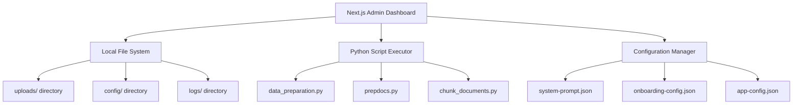
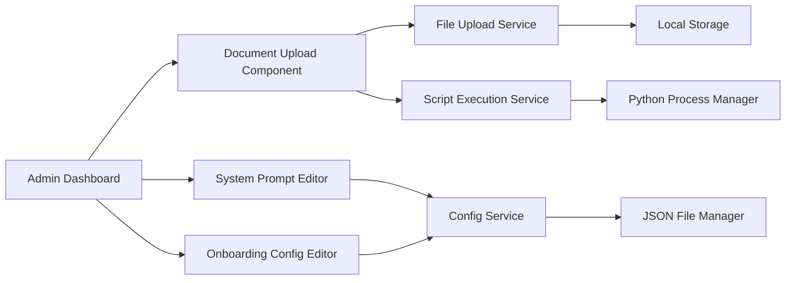

# Admin Dashboard Integration Design

## Overview

This design document outlines the architecture for refactoring the existing admin-fe dashboard into a standalone Next.js application that integrates with the document processing scripts. The solution will provide a local development environment for managing documents, system configurations, and AI assistant settings.

## Architecture

### High-Level Architecture



### Component Architecture



## Components and Interfaces

### 1. Next.js Application Structure

```
admin-dashboard/
├── pages/
│   ├── api/
│   │   ├── admin/
│   │   │   ├── upload-doc.ts
│   │   │   ├── ingest-docs.ts
│   │   │   └── config/
│   │   │       ├── system-prompt.ts
│   │   │       └── onboarding.ts
│   │   └── health.ts
│   ├── admin.tsx
│   └── index.tsx
├── components/
│   ├── ui/ (shadcn components)
│   └── admin/
│       ├── document-upload.tsx
│       ├── system-prompt-editor.tsx
│       ├── onboarding-config-editor.tsx
│       └── admin-auth-dialog.tsx
├── lib/
│   ├── admin-api-service.ts
│   ├── file-manager.ts
│   ├── script-executor.ts
│   └── config-manager.ts
├── public/
├── styles/
└── data/
    ├── uploads/
    ├── config/
    └── logs/
```

### 2. API Endpoints Design

#### Document Upload API (`/api/admin/upload-doc`)
```typescript
interface UploadRequest {
  file: File
}

interface UploadResponse {
  success: boolean
  filename: string
  path: string
  message?: string
}
```

#### Ingestion Trigger API (`/api/admin/ingest-docs`)
```typescript
interface IngestionRequest {
  files?: string[]
  config?: ProcessingConfig
}

interface IngestionResponse {
  success: boolean
  jobId: string
  status: 'started' | 'running' | 'completed' | 'failed'
  message?: string
  logs?: string[]
}
```

#### Configuration APIs
```typescript
// System Prompt API
interface SystemPromptConfig {
  prompt: string
  lastModified: string
}

// Onboarding Config API
interface OnboardingConfig {
  [persona: string]: {
    topics: Array<{
      label: string
      warmup_prompt: string
      quick_questions: string[]
    }>
  }
}
```

### 3. Service Layer Design (Modular & Azure-Ready)

#### Storage Abstraction Layer
```typescript
interface StorageProvider {
  saveFile(file: File, path: string): Promise<string>
  listFiles(directory: string): Promise<FileInfo[]>
  deleteFile(path: string): Promise<boolean>
  getFileUrl(path: string): Promise<string>
}

class LocalStorageProvider implements StorageProvider {
  // Local file system implementation for development
}

class AzureBlobStorageProvider implements StorageProvider {
  // Azure Blob Storage implementation leveraging existing scripts
  constructor(private connectionString: string, private containerName: string) {}
  
  async saveFile(file: File, path: string): Promise<string> {
    // Uses Azure SDK patterns from existing scripts
    // Integrates with downloadBlobUrlToLocalFolder patterns
  }
}

class FileManager {
  constructor(private storageProvider: StorageProvider) {}
  
  async saveUploadedFile(file: File, directory: string): Promise<string> {
    return this.storageProvider.saveFile(file, directory)
  }
}
```

#### Script Executor Service (Leveraging Existing Capabilities)
```typescript
class ScriptExecutor {
  // Direct integration with existing scripts and their Azure capabilities
  async executeDataPreparation(config: ProcessingConfig): Promise<ExecutionResult> {
    // Uses data_preparation.py with full Azure integration:
    // - Azure Cognitive Search service creation/management
    // - Azure Blob Storage support
    // - Form Recognizer integration
    // - Azure OpenAI embeddings
    const args = this.buildDataPrepArgs(config)
    return this.executeScript('data_preparation.py', args)
  }
  
  async executeAMLPipeline(config: AMLConfig): Promise<ExecutionResult> {
    // Uses existing AML pipeline components:
    // - chunk_documents.py with KeyVault integration
    // - embed_documents.py with Azure OpenAI
    // - push_to_acs.py with search index management
    return this.executeAMLWorkflow(config)
  }
  
  async executeBatchIndexing(config: BatchConfig): Promise<ExecutionResult> {
    // Uses run_batch_create_index.py for multiple indexes
    return this.executeScript('run_batch_create_index.py', [])
  }
  
  private buildDataPrepArgs(config: ProcessingConfig): string[] {
    // Builds arguments compatible with existing script parameters
    return [
      '--config', this.generateConfigFile(config),
      '--njobs', config.njobs.toString(),
      ...(config.formRecognizerResource ? ['--form-rec-resource', config.formRecognizerResource] : []),
      ...(config.formRecognizerKey ? ['--form-rec-key', config.formRecognizerKey] : []),
      ...(config.embeddingEndpoint ? ['--embedding-model-endpoint', config.embeddingEndpoint] : []),
      ...(config.searchAdminKey ? ['--search-admin-key', config.searchAdminKey] : []),
      ...(config.useFormRecognizerLayout ? ['--form-rec-use-layout'] : []),
    ]
  }
}

interface ExecutionResult {
  success: boolean
  exitCode: number
  stdout: string
  stderr: string
  duration: number
  scriptUsed: string
  azureResourcesCreated?: string[]
}
```

#### Configuration Manager Service (Azure-Compatible)
```typescript
interface ConfigProvider {
  loadConfig<T>(configName: string): Promise<T>
  saveConfig<T>(configName: string, data: T): Promise<boolean>
}

class LocalConfigProvider implements ConfigProvider {
  // JSON file-based configuration for development
}

class AzureKeyVaultConfigProvider implements ConfigProvider {
  // Azure KeyVault integration using patterns from existing scripts
  constructor(private keyVaultUrl: string) {}
}

class ConfigManager {
  constructor(private configProvider: ConfigProvider) {}
  
  async generateScriptConfig(adminConfig: AdminConfig): Promise<ScriptConfig[]> {
    // Converts admin UI config to script-compatible format
    // Supports all existing script configuration options
    return [{
      data_path: adminConfig.dataPath,
      location: adminConfig.azureLocation,
      subscription_id: adminConfig.azureSubscriptionId,
      resource_group: adminConfig.azureResourceGroup,
      search_service_name: adminConfig.searchServiceName,
      index_name: adminConfig.indexName,
      chunk_size: adminConfig.chunkSize,
      token_overlap: adminConfig.tokenOverlap,
      semantic_config_name: adminConfig.semanticConfigName,
      language: adminConfig.language,
      vector_config_name: adminConfig.vectorConfigName,
      // Supports all 30+ languages from SUPPORTED_LANGUAGE_CODES
      // Supports both blob URLs and local paths
      // Supports multiple data_paths configuration
    }]
  }
  
  async generateAMLConfig(adminConfig: AdminConfig): Promise<AMLConfig> {
    // Generates configuration for AML pipeline components
    return {
      chunk_size: adminConfig.chunkSize,
      token_overlap: adminConfig.tokenOverlap,
      keyvault_url: adminConfig.keyVaultUrl,
      document_intelligence_secret_name: adminConfig.docIntelligenceSecretName,
      document_intelligence_endpoint: adminConfig.docIntelligenceEndpoint,
      embedding_key_secret_name: adminConfig.embeddingKeySecretName,
      embedding_endpoint: adminConfig.embeddingEndpoint,
      index_name: adminConfig.indexName,
      search_service_name: adminConfig.searchServiceName,
      search_key_secret_name: adminConfig.searchKeySecretName
    }
  }
}
```

## Data Models

### Processing Configuration (Compatible with Existing Scripts)
```typescript
interface ProcessingConfig {
  // Core configuration matching data_preparation.py parameters
  data_path: string | string[] // Supports both single path and data_paths array
  location: string
  subscription_id?: string
  resource_group?: string
  search_service_name?: string
  index_name: string
  chunk_size: number
  token_overlap: number
  semantic_config_name: string
  language: string // Supports all SUPPORTED_LANGUAGE_CODES from scripts
  vector_config_name?: string
  url_prefix?: string // For document URL construction
  
  // Form Recognizer configuration
  use_form_recognizer: boolean
  form_recognizer_layout: boolean
  formRecognizerResource?: string
  formRecognizerKey?: string
  
  // Azure OpenAI configuration
  embeddingEndpoint?: string
  embeddingKey?: string
  azureOpenAIEndpoint?: string
  azureOpenAIKey?: string
  
  // Processing configuration
  njobs: number // 1-32 as validated by existing scripts
  searchAdminKey?: string
  
  // Storage configuration (for easy Azure migration)
  storageType: 'local' | 'blob'
  blobConnectionString?: string
  containerName?: string
}

interface AMLConfig {
  // Configuration for Azure ML pipeline components
  chunk_size: number
  token_overlap: number
  keyvault_url?: string
  document_intelligence_secret_name?: string
  document_intelligence_endpoint?: string
  embedding_key_secret_name?: string
  embedding_endpoint?: string
  index_name: string
  search_service_name: string
  search_key_secret_name?: string
  use_layout: boolean
}

interface BatchConfig {
  // Configuration for batch index creation
  baseConfig: ProcessingConfig
  indexConfigs: Array<{
    key: string
    index: string
    subfolder?: string
    formRecUseLayout?: boolean
  }>
}
```

### Application Configuration
```typescript
interface AppConfig {
  pythonPath: string
  scriptsPath: string
  uploadsPath: string
  configPath: string
  logsPath: string
  maxFileSize: number
  allowedFileTypes: string[]
  mockMode: boolean
}
```

## Error Handling

### Error Types
```typescript
enum ErrorType {
  FILE_UPLOAD_ERROR = 'FILE_UPLOAD_ERROR',
  SCRIPT_EXECUTION_ERROR = 'SCRIPT_EXECUTION_ERROR',
  CONFIG_VALIDATION_ERROR = 'CONFIG_VALIDATION_ERROR',
  PYTHON_ENVIRONMENT_ERROR = 'PYTHON_ENVIRONMENT_ERROR',
  FILE_SYSTEM_ERROR = 'FILE_SYSTEM_ERROR'
}

interface AppError {
  type: ErrorType
  message: string
  details?: any
  timestamp: Date
  stack?: string
}
```

### Error Handling Strategy
1. **Client-side validation** for immediate feedback
2. **Server-side validation** for security and data integrity
3. **Graceful degradation** when services are unavailable
4. **Comprehensive logging** for debugging
5. **User-friendly error messages** with actionable guidance

## Testing Strategy

### Unit Tests
- Configuration management functions
- File upload/download utilities
- Script execution wrappers
- Data validation logic

### Integration Tests
- API endpoint functionality
- File system operations
- Python script execution
- Configuration persistence

### End-to-End Tests
- Complete document upload and processing workflow
- Configuration management across page reloads
- Error handling scenarios
- Authentication flow

## Security Considerations

### File Upload Security
- File type validation
- File size limits
- Virus scanning (optional)
- Secure file storage

### Script Execution Security
- Input sanitization
- Command injection prevention
- Resource limits
- Sandboxed execution environment

### Configuration Security
- Input validation
- XSS prevention
- CSRF protection
- Secure defaults

## Performance Considerations

### File Handling
- Streaming uploads for large files
- Progress tracking
- Concurrent upload limits
- Cleanup of temporary files

### Script Execution
- Asynchronous execution
- Progress monitoring
- Resource monitoring
- Timeout handling

### Caching Strategy
- Configuration caching
- File metadata caching
- Script result caching
- Browser caching for static assets

## Deployment Strategy

### Development Environment
- Local file system storage
- Mock mode for external services
- Hot reloading for development
- Comprehensive logging

### Production Considerations
- Environment variable configuration
- Secure file storage
- Process monitoring
- Log rotation
- Backup strategies
## 
Azure Migration Strategy

### Easy Migration Path for Backend Colleagues

The design provides a clear migration path from local development to Azure production:

#### 1. Configuration-Based Migration
```typescript
// Development (local)
const config = {
  storageType: 'local',
  configProvider: 'local',
  // ... other local settings
}

// Production (Azure)
const config = {
  storageType: 'blob',
  blobConnectionString: process.env.AZURE_STORAGE_CONNECTION_STRING,
  containerName: 'documents',
  configProvider: 'keyvault',
  keyVaultUrl: process.env.AZURE_KEYVAULT_URL,
  // ... other Azure settings
}
```

#### 2. Leveraging Existing Script Capabilities
The admin dashboard directly uses existing scripts which already support:

- **Azure Cognitive Search**: Service creation, index management, document upload
- **Azure Blob Storage**: Document download, processing from blob URLs
- **Azure Form Recognizer**: PDF processing with Layout/Read models
- **Azure OpenAI**: Embedding generation for vector search
- **Azure KeyVault**: Secret management for AML pipelines
- **Azure ML**: Complete pipeline orchestration

#### 3. Zero-Code Migration for Core Features
Backend colleagues can migrate by simply:

1. **Updating environment variables** (no code changes needed)
2. **Switching storage providers** through configuration
3. **Using existing Azure authentication** patterns from scripts
4. **Leveraging existing error handling** and retry logic

#### 4. Gradual Migration Support
- Start with local file storage, migrate to Azure Blob Storage
- Begin with local configs, move to Azure KeyVault
- Use mock mode initially, then enable full Azure integration
- Maintain backward compatibility throughout migration

This design ensures that your backend colleague can easily transition from the local development setup to a full Azure production environment by leveraging all the existing, battle-tested Azure capabilities already built into the scripts.