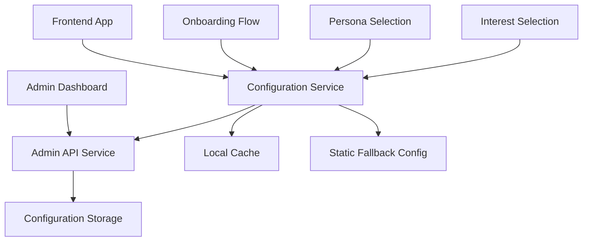
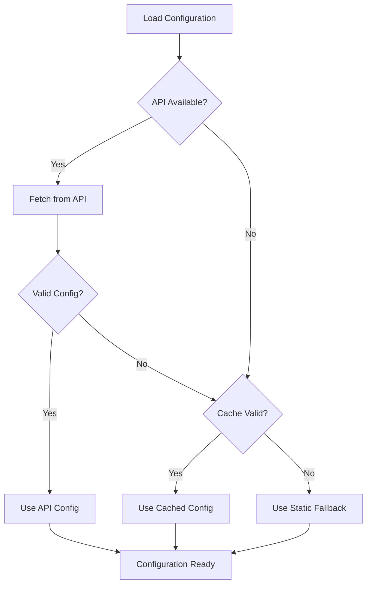

# Design Document

## Overview

This design implements a dynamic onboarding configuration system that bridges the admin dashboard's configuration editor with the frontend onboarding flow. **The system will NOT replace the existing hardcoded configuration** but will add an optional dynamic layer on top of it, ensuring the current working onboarding flow remains completely intact.

The solution prioritizes safety and backward compatibility by:
- Keeping all existing configuration files and logic unchanged
- Adding dynamic configuration as an optional enhancement layer
- Ensuring the system defaults to current working behavior if anything fails
- Providing a feature flag to enable/disable dynamic configuration

## Architecture

### High-Level Architecture



### Data Flow

1. **Admin Configuration**: Admin updates configuration through the dashboard
2. **API Storage**: Configuration is stored via admin API endpoints
3. **Frontend Fetch**: Frontend configuration service fetches latest config on app load
4. **Caching**: Configuration is cached locally with TTL for performance
5. **Fallback**: If API is unavailable, system uses hardcoded fallback configuration
6. **Real-time Updates**: Configuration changes are reflected within 30 seconds

## Components and Interfaces

### 1. Configuration Service Layer

#### OnboardingConfigService
```typescript
interface OnboardingConfigService {
  // Core methods
  getConfiguration(): Promise<OnboardingConfig>
  getPersonaConfig(persona: string): Promise<PersonaTopics | null>
  getTopicsForPersona(persona: string): Promise<OnboardingTopic[]>
  
  // Cache management
  refreshConfiguration(): Promise<void>
  clearCache(): void
  
  // Validation
  validateConfiguration(config: OnboardingConfig): boolean
  
  // Events
  onConfigurationChange(callback: (config: OnboardingConfig) => void): void
}
```

#### Configuration Types
```typescript
interface DynamicOnboardingConfig extends OnboardingConfig {
  version: string
  lastModified: string
  source: 'api' | 'fallback'
}

interface ConfigurationCache {
  config: DynamicOnboardingConfig
  timestamp: number
  ttl: number
}
```

### 2. Enhanced Frontend Configuration

#### Enhanced quickQuestions.ts (Non-Breaking)
```typescript
// SAFETY: All existing exports remain unchanged
// Existing static configuration and functions work exactly as before
export const quickQuestionsConfig: QuickQuestionsConfig = { /* existing config */ }
export const getTopicsForPersona = (persona: string): QuickQuestionTopic[] => { /* existing function */ }
export const getTopicByLabel = (persona: string, topicLabel: string): QuickQuestionTopic | null => { /* existing function */ }

// NEW: Optional dynamic configuration layer (feature-flagged)
export class DynamicQuickQuestionsManager {
  private static instance: DynamicQuickQuestionsManager
  private configService: OnboardingConfigService
  private featureEnabled: boolean = false // DISABLED BY DEFAULT
  
  // Only used when feature flag is enabled
  async getTopicsForPersonaAsync(persona: string): Promise<QuickQuestionTopic[]> {
    if (!this.featureEnabled) {
      return getTopicsForPersona(persona) // Use existing static function
    }
    // Dynamic logic only when enabled
  }
}
```

### 3. API Integration Layer

#### Frontend API Client
```typescript
interface FrontendConfigApi {
  fetchOnboardingConfig(): Promise<OnboardingConfig>
  checkConfigVersion(): Promise<string>
  subscribeToUpdates(callback: (config: OnboardingConfig) => void): void
}
```

### 4. Updated Onboarding Components

#### Enhanced OnboardingFlow (Backward Compatible)
- **Default Behavior**: Works exactly as it does now
- **Optional Enhancement**: When feature flag enabled, can load dynamic config
- **Zero Risk**: If dynamic config fails, uses existing static behavior
- **No Changes**: Existing props, state, and logic remain unchanged

#### Enhanced PersonaSelection (Backward Compatible)
- **Default Behavior**: Uses existing persona configuration
- **Optional Enhancement**: When enabled, can show admin-configured personas
- **Fallback**: Always falls back to existing hardcoded personas
- **Theming**: Existing theme system remains primary

#### Enhanced InterestSelection (Backward Compatible)
- **Default Behavior**: Uses existing topic configuration
- **Optional Enhancement**: When enabled, can load dynamic topics
- **Safety**: Always has existing topics as fallback
- **No Breaking Changes**: Existing component API unchanged

## Data Models

### Configuration Schema
```typescript
interface DynamicOnboardingTopic extends OnboardingTopic {
  id?: string
  enabled: boolean
  order: number
  metadata?: {
    created: string
    modified: string
    author?: string
  }
}

interface DynamicPersonaConfig {
  topics: DynamicOnboardingTopic[]
  enabled: boolean
  displayName?: string
  description?: string
  theme?: PersonaTheme
  metadata?: {
    created: string
    modified: string
    author?: string
  }
}

interface DynamicOnboardingConfig {
  [persona: string]: DynamicPersonaConfig
  _meta: {
    version: string
    lastModified: string
    source: 'api' | 'fallback'
    checksum?: string
  }
}
```

### Persona Theme Integration
```typescript
interface PersonaTheme {
  bg: string
  text: string
  primary: string
  secondary: string
  userBubble: string
  accent: string
}

interface PersonaConfigWithTheme extends DynamicPersonaConfig {
  theme: PersonaTheme
  icon: string
  name: string
  description: string
}
```

## Error Handling

### Error Types
```typescript
enum ConfigurationErrorType {
  NETWORK_ERROR = 'network_error',
  VALIDATION_ERROR = 'validation_error',
  CACHE_ERROR = 'cache_error',
  FALLBACK_ERROR = 'fallback_error'
}

interface ConfigurationError {
  type: ConfigurationErrorType
  message: string
  details?: any
  timestamp: string
  recoverable: boolean
}
```

### Error Handling Strategy

1. **Network Failures**: Use cached configuration, fall back to static config
2. **Validation Failures**: Log error, use previous valid configuration
3. **Cache Corruption**: Clear cache, refetch from API
4. **Complete Failure**: Use hardcoded fallback configuration

### Graceful Degradation



## Testing Strategy

### Unit Tests
- Configuration service methods
- Validation functions
- Cache management
- Error handling scenarios

### Integration Tests
- API communication
- Configuration loading flow
- Fallback mechanisms
- Component integration with dynamic config

### End-to-End Tests
- Complete onboarding flow with dynamic config
- Admin configuration changes reflected in frontend
- Error scenarios and recovery
- Performance under various network conditions

## Performance Considerations

### Caching Strategy
- **TTL**: 5 minutes for configuration cache
- **Refresh**: Background refresh when TTL expires
- **Storage**: localStorage for persistence across sessions
- **Compression**: Gzip configuration data for storage

### Loading Optimization
- **Preload**: Fetch configuration during app initialization
- **Lazy Loading**: Load persona-specific config on demand
- **Bundling**: Include fallback config in main bundle
- **CDN**: Serve configuration from CDN when possible

### Memory Management
- **Cleanup**: Clear unused configuration data
- **Limits**: Maximum cache size limits
- **Monitoring**: Track memory usage of configuration data

## Safety-First Implementation Strategy

### Phase 1: Non-Invasive Infrastructure
1. Create configuration service layer as separate module
2. Implement API client without touching existing code
3. Add feature flag system for safe testing
4. Create comprehensive fallback mechanisms

### Phase 2: Optional Enhancement Layer
1. Add dynamic config as opt-in feature to existing components
2. Ensure all existing paths continue to work unchanged
3. Add dynamic config only as additional option, not replacement
4. Extensive testing with feature flag disabled (current behavior)

### Phase 3: Careful Rollout
1. Deploy with feature flag disabled by default
2. Test dynamic config in development environment only
3. Gradual opt-in testing with admin users
4. Monitor for any impact on existing onboarding flow

### Backward Compatibility Guarantees
- **Zero Changes** to existing onboarding flow by default
- **Feature Flag** controls dynamic config (disabled by default)
- **Existing Code Paths** remain completely untouched
- **Static Configuration** remains primary source of truth
- **Dynamic Config** only adds enhancement when explicitly enabled
- **Automatic Fallback** to current behavior on any failure
- **No Breaking Changes** to existing user experience