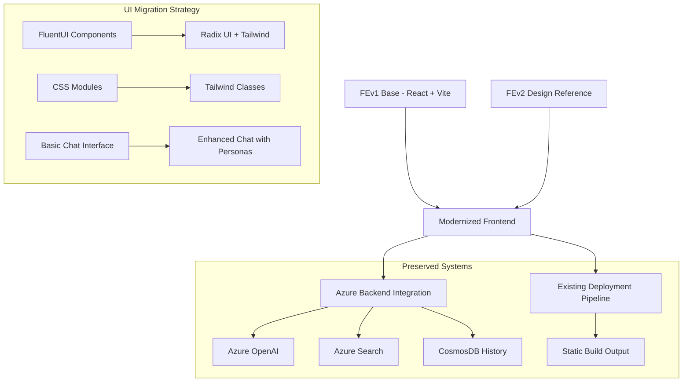

# Design Document

## Overview

This design outlines the modernization of the existing React-based frontend (FEv1) by incorporating the superior design patterns, UI components, and user experience elements from the Next.js-based frontend-v2 (FEv2). The approach preserves FEv1's working Azure backend integration and Vite-based deployment pipeline while systematically upgrading the user interface and experience to match FEv2's polished design.

## Architecture

### High-Level Architecture



### Migration Strategy Overview

The design follows a **progressive enhancement approach**:
1. **Foundation Layer**: Maintain FEv1's React + Vite architecture
2. **Design System Layer**: Replace FluentUI with Radix UI + Tailwind CSS
3. **Component Layer**: Rebuild components using FEv2's design patterns
4. **Feature Layer**: Add persona-based interactions and enhanced UX
5. **Integration Layer**: Preserve all Azure backend connections

## Components and Interfaces

### 1. Design System Migration

**From FluentUI to Radix + Tailwind**

Current FEv1 Stack:
```typescript
// Current dependencies
"@fluentui/react": "^8.109.0"
"@fluentui/react-hooks": "^8.6.29"
"@fluentui/react-icons": "^2.0.195"
```

Target Modern Stack:
```typescript
// New dependencies (from FEv2)
"@radix-ui/react-*": "latest"
"tailwindcss": "^3.4.17"
"lucide-react": "^0.454.0"
"class-variance-authority": "^0.7.1"
"tailwind-merge": "^2.5.5"
```

**Color Palette and Theming**
```typescript
// Extracted from FEv2
const personaConfig = {
  elev: {
    theme: {
      bg: "bg-[#FEEFF7]",
      text: "text-[#07050a]",
      primary: "bg-[#D0337D] hover:bg-[#B02A6B]",
      userBubble: "bg-[#D0337D]",
      accent: "border-[#D0337D]"
    }
  },
  părinte: {
    theme: {
      primary: "bg-[#ff4773] hover:bg-[#E63E66]",
      userBubble: "bg-[#ff4773]",
      accent: "border-[#ff4773]"
    }
  },
  profesor: {
    theme: {
      primary: "bg-[#9a6ae1] hover:bg-[#8A5DD1]",
      userBubble: "bg-[#9a6ae1]",
      accent: "border-[#9a6ae1]"
    }
  },
  incognito: {
    theme: {
      primary: "bg-gray-600 hover:bg-gray-700",
      userBubble: "bg-gray-600",
      accent: "border-gray-600"
    }
  }
}
```

### 2. Onboarding Flow Component

**New Onboarding System**
```typescript
interface OnboardingData {
  persona: 'elev' | 'părinte' | 'profesor' | 'incognito' | null
  interest: InterestArea | null
  selectedTopicLabel: string | null
}

interface OnboardingFlowProps {
  onComplete: (data: OnboardingData) => void
}
```

**Component Structure**:
- **Step 1**: Persona selection with 2x2 grid layout
- **Step 2**: Interest area selection (conditional on persona)
- **Incognito Path**: Direct to chat without interest selection
- **Romanian Localization**: All text in Romanian

### 3. Enhanced Chat Interface

**Message Component Redesign**
```typescript
interface EnhancedMessage extends ChatMessage {
  citations?: Citation[]
  rating?: 'up' | 'down' | null
  flagged?: boolean
  isStreaming?: boolean
  persona?: Persona
}
```

**Chat Layout Structure**:
```
┌─────────────────────────────────────┐
│ Header (Persona + Stats)            │
├─────────────────────────────────────┤
│ Messages Area                       │
│ ┌─────────────────────────────────┐ │
│ │ User Message (Persona-themed)   │ │
│ └─────────────────────────────────┘ │
│ ┌─────────────────────────────────┐ │
│ │ AI Response + Citations         │ │
│ │ └─ Feedback Controls            │ │
│ └─────────────────────────────────┘ │
├─────────────────────────────────────┤
│ Quick Questions (Persona-based)     │
├─────────────────────────────────────┤
│ Input Area + Send Button            │
└─────────────────────────────────────┘
```

### 4. Conversation History Panel

**History Management System**
```typescript
interface Conversation {
  id: string
  persona: Persona
  interest: InterestArea | null
  summary: string
  messages: EnhancedMessage[]
  name: string
  archived: boolean
  date: string
}

interface HistoryPanelProps {
  conversations: Conversation[]
  onLoadConversation: (id: string) => void
  onEditName: (id: string, name: string) => void
  onArchive: (id: string) => void
}
```

**Features**:
- Conversation list with persona indicators
- Edit conversation names inline
- Archive/unarchive conversations
- Search and filter capabilities
- Persona-based grouping

### 5. Citation and Feedback System

**Enhanced Citation Panel**
```typescript
interface CitationPanelProps {
  citations: Citation[]
  isOpen: boolean
  onClose: () => void
  onViewSource: (citation: Citation) => void
}
```

**Feedback System**
```typescript
interface MessageFeedbackProps {
  messageId: string
  currentRating: 'up' | 'down' | null
  flagged: boolean
  onRate: (rating: 'up' | 'down') => void
  onFlag: () => void
}
```

## Data Models

### 1. Persona Configuration Model
```typescript
interface PersonaConfig {
  name: string
  icon: LucideIcon
  theme: {
    bg: string
    text: string
    primary: string
    secondary: string
    userBubble: string
    accent: string
  }
}
```

### 2. Quick Questions Model
```typescript
interface QuickQuestionsConfig {
  [persona: string]: {
    topics: Array<{
      label: string
      questions: string[]
    }>
  }
}
```

### 3. Session Statistics Model
```typescript
interface SessionStats {
  sessionId: string
  startTime: Date
  totalMessages: number
  totalTokens: number
  inputTokens: number
  outputTokens: number
  estimatedCost: number
  averageResponseTime: number
  persona: Persona
  interest: InterestArea | null
}
```

## Error Handling

### 1. Component Migration Errors
- **Detection**: TypeScript compilation errors during FluentUI to Radix migration
- **Response**: Gradual component replacement with fallback to original components
- **Recovery**: Maintain component compatibility layers during transition

### 2. Styling Conflicts
- **Detection**: CSS conflicts between existing styles and new Tailwind classes
- **Response**: Use CSS-in-JS solutions or scoped styles during transition
- **Recovery**: Systematic removal of old CSS modules as components are migrated

### 3. State Management Issues
- **Detection**: State inconsistencies when adding persona-based features
- **Response**: Extend existing AppStateContext with new persona state
- **Recovery**: Maintain backward compatibility with existing state structure

### 4. API Integration Preservation
- **Detection**: Broken Azure backend connections during UI updates
- **Response**: Maintain existing API service layer unchanged
- **Recovery**: Comprehensive testing of all backend integrations after each component migration

## Testing Strategy

### 1. Component Migration Testing
- **Unit Tests**: Test each migrated component in isolation
- **Visual Regression Tests**: Compare FEv1 vs modernized component appearance
- **Accessibility Tests**: Ensure Radix UI components maintain accessibility standards
- **Integration Tests**: Verify persona-based theming works correctly

### 2. Backend Integration Testing
- **API Compatibility Tests**: Ensure all Azure service calls continue working
- **Authentication Tests**: Verify auth flows remain intact
- **History Management Tests**: Test CosmosDB integration with new conversation features
- **Streaming Tests**: Ensure chat streaming continues to work with new UI

### 3. User Experience Testing
- **Onboarding Flow Tests**: Test all persona selection paths
- **Responsive Design Tests**: Verify mobile compatibility
- **Performance Tests**: Ensure new components don't degrade performance
- **Localization Tests**: Verify Romanian text displays correctly throughout

## Implementation Phases

### Phase 1: Foundation Setup (Requirements 1, 7)
**Goal**: Establish new design system without breaking existing functionality

**Tasks**:
1. Install Radix UI and Tailwind CSS dependencies
2. Configure Tailwind with FEv2's color palette
3. Create base component library (Button, Input, Card, etc.)
4. Set up persona configuration system
5. Maintain all existing Azure integrations

**Success Criteria**:
- New design system installed and configured
- Existing chat functionality remains fully operational
- All Azure backend connections preserved

### Phase 2: Onboarding System (Requirements 2, 6)
**Goal**: Implement persona-based onboarding flow

**Tasks**:
1. Create onboarding flow components
2. Implement persona selection interface
3. Add interest area selection for non-incognito personas
4. Integrate Romanian localization
5. Connect onboarding to existing chat initialization

**Success Criteria**:
- Complete onboarding flow matching FEv2 design
- Persona selection affects chat theming
- Romanian text throughout onboarding
- Smooth transition to chat interface

### Phase 3: Chat Interface Enhancement (Requirements 3, 5)
**Goal**: Modernize chat interface with enhanced features

**Tasks**:
1. Rebuild chat message components with persona theming
2. Implement enhanced feedback system (rating, flagging)
3. Add citation panel functionality
4. Create quick questions system based on persona/interest
5. Improve message styling and layout

**Success Criteria**:
- Chat interface matches FEv2's visual design
- Persona-based theming throughout chat
- Enhanced feedback system functional
- Citation panel displays properly
- Quick questions adapt to user persona

### Phase 4: History and Navigation (Requirements 4, 8)
**Goal**: Add comprehensive conversation management

**Tasks**:
1. Implement conversation history panel
2. Add conversation naming and archiving
3. Create new conversation functionality
4. Implement conversation loading and switching
5. Ensure mobile responsiveness

**Success Criteria**:
- Full conversation history management
- Seamless conversation switching
- Mobile-responsive design
- All features accessible via keyboard navigation

## Security Considerations

- **Authentication Preservation**: Maintain existing Azure authentication flows
- **Data Privacy**: Ensure persona selection doesn't compromise user privacy
- **Input Sanitization**: Preserve existing XSS protection measures
- **API Security**: Maintain all existing Azure service security configurations
- **Session Management**: Ensure conversation history security matches existing implementation

## Performance Considerations

- **Bundle Size**: Monitor impact of new dependencies on build size
- **Runtime Performance**: Ensure persona theming doesn't impact chat performance
- **Memory Usage**: Optimize conversation history storage and retrieval
- **Loading Times**: Maintain fast initial page load with new onboarding flow
- **Streaming Performance**: Ensure enhanced UI doesn't impact message streaming speed

## Accessibility Compliance

- **WCAG 2.1 AA**: Maintain compliance through Radix UI components
- **Keyboard Navigation**: Ensure all new features are keyboard accessible
- **Screen Reader Support**: Verify persona information is properly announced
- **Color Contrast**: Ensure all persona themes meet contrast requirements
- **Focus Management**: Proper focus handling in onboarding and chat flows